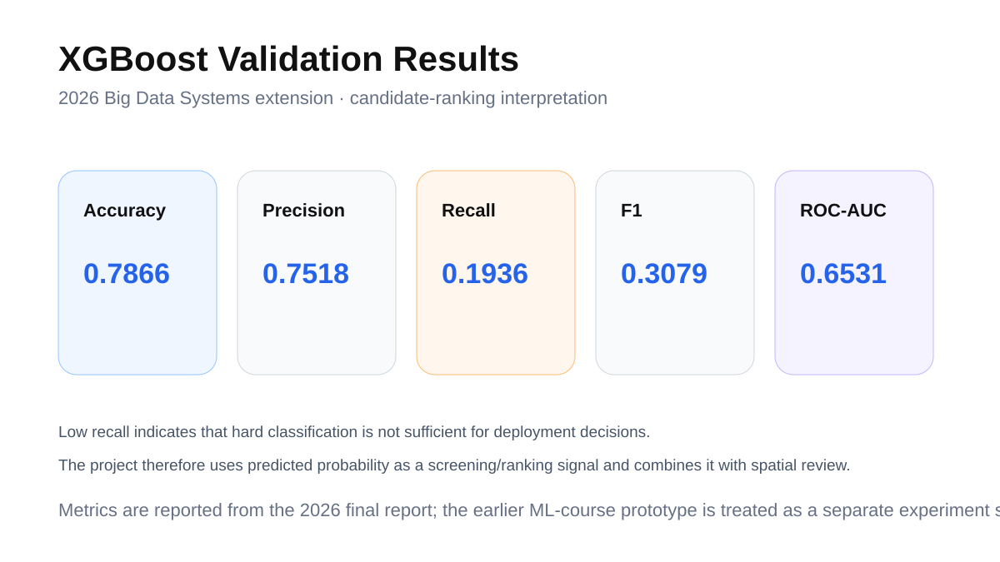
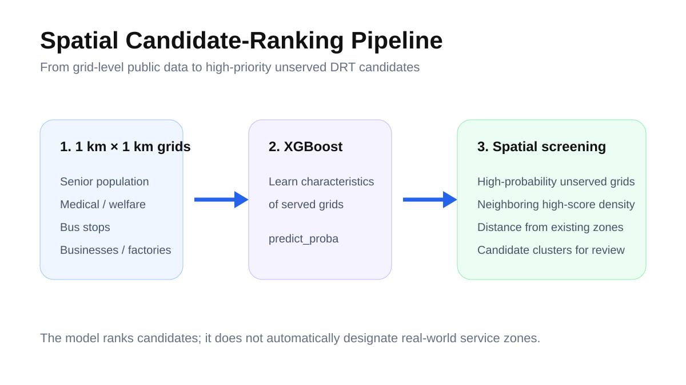
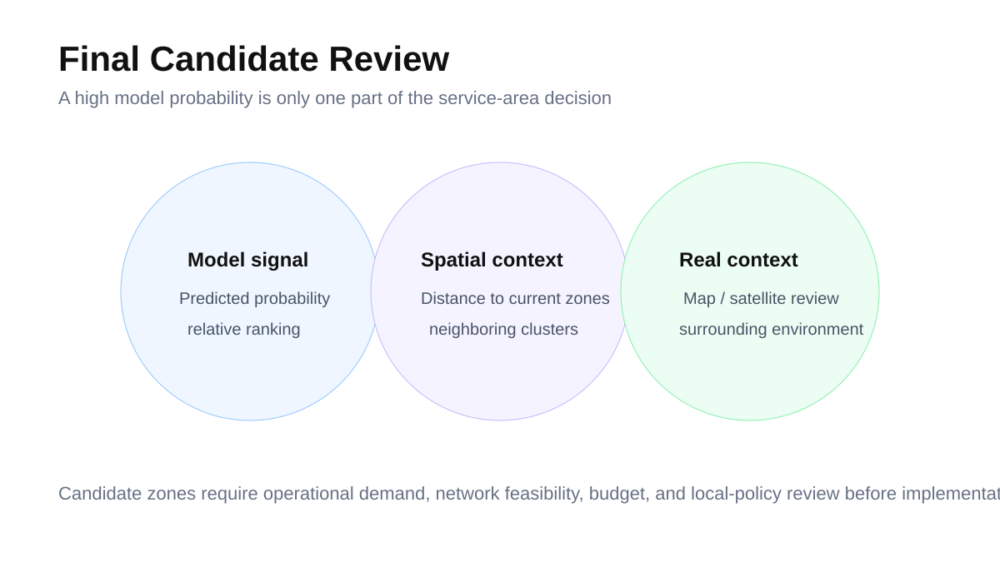

# Data-Driven DRT Service-Area Analysis for Gyeonggi Ddok-Bus

> Grid-level machine learning and spatial screening to identify candidate areas for expanding demand-responsive transit (DRT) service.

**Project progression:** IE Machine Learning prototype → Big Data Systems extension (2026)  
**Core tools:** PySpark-oriented data processing · XGBoost · geospatial grid analysis  
**Spatial unit:** 1 km × 1 km grid

---

## Problem

Gyeonggi's Ddok-Bus is a demand-responsive transit service intended to complement fixed-route public transportation, particularly in areas with accessibility constraints. Because the service operates only inside predefined service zones, deciding **where to open a new zone** becomes a spatial decision problem involving mobility equity, population needs, facilities, and existing transport structure.

## Analytical objective

Learn the characteristics of currently served areas and identify **unserved 1 km × 1 km grids** with similar service-area characteristics. Candidate grids are then reviewed using model probability, spatial clustering, distance from existing service zones, and surrounding real-world context.

## Features

The project integrated grid-level public-data features such as:

- Senior population
- Medical / welfare and daily-life facilities
- Bus stops
- Businesses / factories
- Other local service-infrastructure indicators

## Model & validation

The 2026 Big Data Systems report used an **XGBoost binary classifier** and interpreted the model primarily as a candidate-ranking system.

| Metric | Value |
|---|---:|
| Accuracy | **0.7866** |
| Precision | 0.7518 |
| Recall | 0.1936 |
| F1-score | 0.3079 |
| ROC-AUC | 0.6531 |

The relatively low recall shows why the model should not be treated as an automatic service-zone decision rule. Instead, the project used predicted probabilities as one screening signal in a broader spatial review.

## Spatial prioritization

High-probability unserved grids were examined together with the density of neighboring high-probability cells and their distance from existing DRT zones.

The final stage added map / satellite-context review to convert a model ranking into policy-review candidates.

## Earlier prototype

The earlier IE Machine Learning presentation explored the same expansion problem with alternative model-selection and qualitative spatial analysis. Under that earlier setup, the XGBoost experiment reported **AUC 0.70349**. Because the datasets / design stages differ, this result is kept separate from the 2026 report metrics rather than presented as a direct before-after improvement.

## Project outputs

- [`outputs/ddokbus-project-public-excerpt.pdf`](outputs/ddokbus-project-public-excerpt.pdf) - concise public-safe technical excerpt covering the final analysis and decision framing.
- [`outputs/PROJECT_OUTPUTS.md`](outputs/PROJECT_OUTPUTS.md) - source provenance, version notes, cleanup notes, and verified analytical evidence.

## Repository scope

This repository documents the analytical workflow and public-safe outputs. It does not claim that model probability alone is sufficient for real-world DRT deployment; operational demand, road-network feasibility, budget, and local policy review would be needed for implementation.

---

**Junha Won** · Ajou University  
[Portfolio](https://juna0926.github.io/Portfolio/) · [GitHub](https://github.com/Juna0926)
